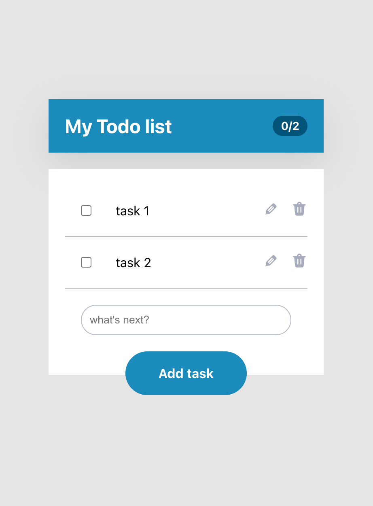

# Todo list backend service

Дараах зааврын дагуу todo list service бичих ба хийж дуусад урьдчилан бэлдсэн [Front-end](../front-end/) кодтой холбох юм.

## Setup

1. Mongodb database үүсгэх
2. Express project үүсгэх
3. mongodb connection string- ээ кодон дотроо явуулна.

## A variant

- `GET http://localhost:5000` руу хандахад ‘Todo list backend’ гэж буцаах. / 1 оноо /
- `GET http://localhost:5000/test` руу хандахад ‘This is test endpoint’ гэж буцаах. / 1 оноо /
- Mongodb-тэй холбох terminal дээр `Successfully connected mongodb` гэж харуулах / 5 оноо /
- Task schema үүсгэх
  - text : string / 1 оноо /
  - isDone : boolean, default: false / 1 оноо /
  - createdDate: date / 1 оноо /
  
- `GET http://localhost:5000/list` руу хандахад list-ийг array болгож буцаана.
  - Endpoint руу хандахад ямар нэг юм буцаадаг байна. / 1 оноо /
  - Mongoose query бичсэн байна. / 2 оноо /
  - Query-ээс авсан утгаа буцаана. / 2 оноо /
- `GET http://localhost:5000/count` руу хандахад isDone task-уудын тоог буцаана.
  - Endpoint руу хандахад ямар нэг юм буцаадаг байна / 1 оноо /
  - Mongoose query бичсэн байна. / 2 оноо /
  - Query-ээс авсан утгаа буцаана. / 2 оноо /
- `POST http://localhost:5000/add` руу post хүсэлт тавьж task нэмнэ.
  - Endpoint руу хандахад ямар нэг юм буцаадаг байна. / 1 оноо /
  - Mongoose query бичсэн байна. / 2 оноо /
  - Query-ээс авсан утгаа буцаана. / 2 оноо /
- `DELETE http://localhost:5000/delete` руу delete хүсэлтээр task устгана. Header дээр id дамжуулна.
  - Endpoint руу хандахад ямар нэг юм буцаадаг байна. / 1 оноо /
  - Mongoose query бичсэн байна. / 2 оноо /
  - Query-ээс авсан утгаа буцаана. / 2 оноо /
- `PATCH http://localhost:5000/update` руу patch хүсэлт явуулж text-ээ засна.
  - Endpoint руу хандахад ямар нэг юм буцаадаг байна. / 1 оноо /
  - Mongoose query бичсэн байна. / 2 оноо /
  - Query-ээс авсан утгаа буцаана. / 2 оноо /
- `PATCH http://localhost:5000/checked` руу хүсэлт явуулж isDone утгыг солино.
  - Endpoint руу хандахад ямар нэг юм буцаадаг байна / 1 оноо /
  - Mongoose query бичсэн байна. / 2 оноо /
  - Query-ээс авсан утгаа буцаана. / 2 оноо /
- Router ashiglasan eseh / 3 оноо /
- Frontend холбох

  Дараах endpoint-уудыг frontend дээр ашигласан байх

  - `GET http://localhost:5000/list` / 1 оноо /
  - `GET http://localhost:5000/count` / 1 оноо /
  - `POST http://localhost:5000/add` / 1 оноо /
  - `DELETE http://localhost:5000/delete` / 1 оноо /
  - `PATCH http://localhost:5000/checked` / 1 оноо /
  - `PATCH http://loca lhost:5000/update` / 2 оноо /
